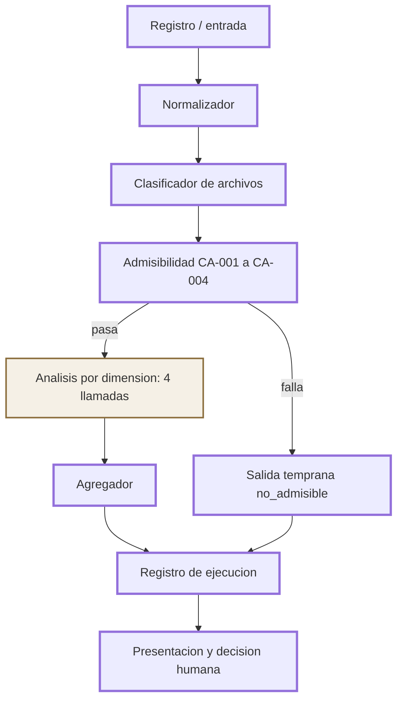
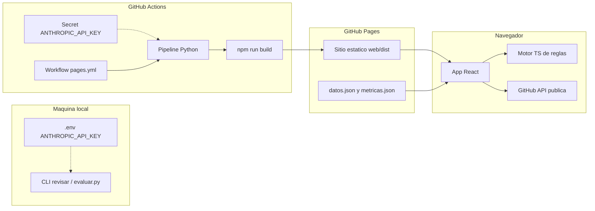
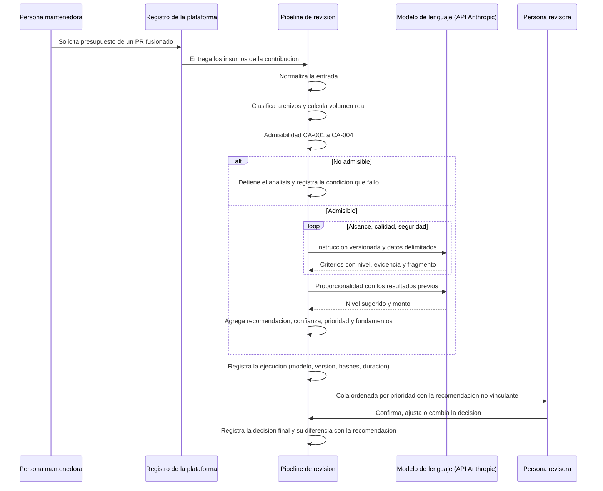

# Prototipo de revisión asistida de contribuciones técnicas: cómo lo construí

Soy Pablo. Este documento describe el prototipo de mi TFG para GrantFox: qué hace, cómo está armado, con qué datos lo evalúo y qué queda pendiente. Cada afirmación remite al código del repo, a la especificación funcional del TFG o a hechos que dejo explícitos aquí. Cuando algo es decisión propia del proyecto (no sale de un marco), lo digo.

## 1. En pocas palabras

El prototipo es un asistente que lee una solicitud de integración ya fusionada y propone una recomendación no vinculante: aprobar, rechazar, ajustar el monto o derivar a revisión humana. No paga, no modifica montos y no escribe en sistemas productivos. Una persona revisora lee el análisis y decide.

El flujo es fijo. Primero normaliza la entrada y clasifica los archivos; con eso comprueba la admisibilidad con reglas deterministas. Si el caso pasa, valora veintitrés criterios en cuatro dimensiones (con modelo o con el motor de reglas) y agrega nivel de recompensa, confianza y prioridad. La salida queda registrada para auditoría.

## 2. Alcance

Qué hace:

| # | Capacidad |
|---|---|
| 1 | Resuelve admisibilidad y detiene el análisis cuando una condición falla |
| 2 | Clasifica archivos y calcula volumen real |
| 3 | Valora los 23 criterios con nivel, evidencia y ubicación |
| 4 | Produce valoración por cada una de las cuatro dimensiones |
| 5 | Propone nivel de recompensa y lo compara con el monto solicitado |
| 6 | Emite recomendación no vinculante con criterios que la sustentan |
| 7 | Declara nivel de confianza y grado de supervisión humana |
| 8 | Calcula prioridad para ordenar la cola |
| 9 | Registra la ejecución (modelo, versión, instrucción, duración) |
| 10 | Enumera lo que no resuelve con los insumos recibidos |

Qué no hace (restricción dura, cláusulas 4B.2 y 13.4 de los Términos y Condiciones de GrantFox):

| # | Restricción |
|---|---|
| 1 | No aprueba, no rechaza y no modifica montos; toda salida es insumo para una persona |
| 2 | No se conecta con sistemas productivos ni tiene credenciales de escritura |
| 3 | No juzga a la persona contribuidora; valora la contribución |
| 4 | No afirma quién produjo la entrega; solo señala indicios de generación sin revisión |
| 5 | No inventa: sin insumo suficiente usa evidencia insuficiente |

La supervisión humana es obligatoria por las cláusulas 4B.2 y 13.4. El nivel de confianza gradúa cuánto hay que mirar; nunca sustituye la revisión (RF10, NIST AI RMF 1.0 en la función de gestionar).

## 3. Arquitectura de la solución

Pipeline de una contribución. Los nodos con borde grueso son código determinista. El nodo con estilo distinto es el único paso que usa el modelo de lenguaje o el motor de reglas.



Registro o entrada. El caso llega como un objeto JSONL con los insumos del registro o se arma en el navegador desde un enlace de PR público. Orquestación en `src/revision/registro.py` (`revisar`) y, en la web, en `web/src/motor/index.ts` (`procesarEntrada`).

Normalizador. Quita campos de etiquetado (`expected`, `excluded`, etc.) y deja solo la entrada del análisis. Implementado en `src/revision/normalizar.py` y portado en `web/src/motor/normalizar.ts`.

Clasificador de archivos. Asigna tipo (código, pruebas, documentación, generado, configuración) y calcula volumen real descontando generados. `src/revision/clasificar.py` y `web/src/motor/clasificar.ts`. Corre antes de la admisibilidad porque CA-003 necesita saber si la entrega trae al menos un archivo de código.

Admisibilidad CA-001 a CA-004. Reglas deterministas con salida temprana si alguna falla; CA-005 queda `no_verificable` porque no está en el insumo. Configuración versionada en `config/admisibilidad.yaml`. Código en `src/revision/admisibilidad.py` y `web/src/motor/admisibilidad.ts`. Cumple el determinismo pedido por RNF-02.

Análisis por dimensión. Único paso no determinista en el sentido del modelo: cuatro llamadas en orden (alcance, calidad, seguridad, proporcionalidad al final porque consume las tres anteriores). En modo real usa Anthropic (`src/revision/analizar.py`); en modo reglas usa heurísticas fijas (`src/revision/reglas.py`, port TS `web/src/motor/reglas.ts`). La instrucción versionada está en `prompts/instruccion_v2.md`; la versión anterior queda en `prompts/instruccion_v1.md` como registro.

Agregador. Dimensiones, recompensa, recomendación, confianza, prioridad y límites, todo en código. `src/revision/agregar.py` y `web/src/motor/agregar.ts`.

Registro de ejecución. Escribe JSON por corrida y append a `runs/registro.jsonl` con modelo, instrucción, hashes y duración. `src/revision/registro.py` (`guardar`). En la demo web el equivalente son `web/public/datos.json` (precalculado) y el estado local de corridas.

Presentación y decisión humana. La persona ve la recomendación y puede registrar su decisión (`src/revision/decision.py`, CLI `--decidir`; en la UI, cola y detalle de PR). Eso cierra RF16 / RG-02 / RG-03 en el prototipo.

## 4. Arquitectura de la aplicación

Componentes y dónde corren:

| Componente | Dónde corre | Rol |
|---|---|---|
| Paquete Python `revision` | Máquina local o GitHub Actions | Pipeline completo; CLI `revisar`; métricas con `evaluar.py` |
| Motor TypeScript `web/src/motor` | Navegador | Puerto del pipeline determinista y del motor de reglas |
| Script `web/scripts/paridad.mjs` | Local (`npm run paridad`) | Compara Python y TS; 100% en 20 casos (12 demo + 8 prueba) |
| App React + Vite | Navegador (build estático) | Vistas: Inicio de corridas, Corrida por etapas E1 a E5, Detalle de PR, Recorrido guiado |
| GitHub API pública | Desde el navegador | Importar un PR por enlace (solo lectura pública) |
| Workflow `.github/workflows/pages.yml` | GitHub Actions | Corre el pipeline y construye el sitio |
| GitHub Pages | CDN estático | Sirve `web/dist` |
| Secreto `ANTHROPIC_API_KEY` | Solo en el paso del pipeline en Actions (o `.env` local) | Nunca en el frontend ni en JSON publicados |

Diagrama de despliegue:



Por qué la clave nunca llega al navegador: el sitio es un build estático. El análisis con modelo ocurre en Actions (o en local con `.env`) antes de publicar. El navegador solo lee JSON ya generados o corre el motor de reglas. No hay backend propio en Pages que pueda guardar la clave.

Por qué el sitio es estático: GitHub Pages sirve archivos. No hay servidor de aplicación ni proxy a Anthropic. Eso cumple RNF-09 (entorno controlado, sin efecto productivo) y evita filtrar el secreto.

Secuencia del flujo real de una contribución:



Sin clave de la API, el paso del modelo lo cumple el motor de reglas deterministas con la misma entrada y la misma salida.

Las etapas E1 a E5 de la UI (`web/src/etapas.ts`) son: admisibilidad, clasificación, dimensiones, agregación, cola humana. Encajan con el pipeline, no lo reemplazan. La interfaz muestra primero la admisibilidad porque es la puerta del análisis; en el código la clasificación se calcula antes porque CA-003 la usa.

## 5. Datos

| Archivo | Contenido | Publicado |
|---|---|---|
| `data/casos-demo.jsonl` | 12 PR reales públicos, muestra con `scripts/muestra_demo.py`, semilla 42; solo campos de entrada | Sí |
| `data/casos-prueba.jsonl` | 8 casos sintéticos para tests y paridad | Sí |
| `data/casos-prueba-tfg.jsonl` | Los 13 casos de prueba del TFG, C-01 a C-13: solo campos de entrada normalizados, sin etiquetas y sin la dirección de la solicitud de integración | Sí |
| `data/golden-set.jsonl` | 66 casos con etiquetas internas (decisiones del proceso) | No; gitignored; solo local |
| `web/public/datos.json` | Salidas precalculadas de la demo | Sí |
| `web/public/metricas.json` | Agregados de evaluación, sin ids ni casos individuales | Sí |

Campos de entrada: `id`, `context.prUrl`, `context.headSha`, `context.title`, `context.body`, `context.merged`, `context.state`, `context.linkedIssueTitle`, `context.linkedIssueBody`, `context.diff`, `context.truncated`, `context.fileStats[]`, `context.ciConclusion`, `context.reviewCommentCount`, `requested_amount`.

Contrato de salida, resumido, más campos que agregué en el prototipo:

| Campo | Rol |
|---|---|
| `contributionId`, `executedAt` | Identidad y marca de tiempo |
| `model.name`, `model.version` | Modelo configurado y el que respondió (o `motor-reglas`) |
| `instructionVersion` | Versión de la instrucción aplicada (`prompts/instruccion_v2.md`) |
| `admissibility` | outcome, stoppedAt, conditions; más `version` (RG-04) |
| `fileClassification` | byType, realVolume, excludedFromVolume; más `porArchivo` |
| `criteria[23]` | code, dimension, level, evidence, file, fragment; más `line` |
| `dimensions[4]` | assessment y unmetCriteria |
| `reward` | requested/suggested level y amount, levelMismatch |
| `recommendation` | value, supportingCriteria, justification |
| `confidence` | score, band, supervision; más `supervisionScope`, reasons |
| `priority` | score, unmetCount, highestSeverity |
| `automationSignals`, `limits` | Indicios y límites declarados |
| `execution` | durationMs, truncatedInput; más `instructionHash`, `entradaHash` |
| `modoEjecucion` | `real` o `reglas` |
| `headSha` | Commit examinado |

Excerpt del contrato mínimo:

```json
{
  "contributionId": "string",
  "admissibility": {
    "outcome": "admisible | no_admisible",
    "stoppedAt": "CA-002 | null",
    "conditions": [
      { "code": "CA-001", "result": "cumple | no_cumple | no_verificable",
        "observed": "dato concreto" }
    ]
  },
  "recommendation": {
    "value": "aprobar | rechazar | ajustar_monto | derivar_revision_humana",
    "supportingCriteria": ["CR-002"],
    "justification": "texto breve"
  },
  "confidence": {
    "score": 0.0,
    "band": "alto | medio | bajo",
    "supervision": "confirmacion | revision_detallada"
  }
}
```

## 6. Reglas de negocio implementadas

Admisibilidad. CA-001 a CA-004 en orden con corte al primer fallo; CA-005 siempre `no_verificable` en este prototipo. Umbral de CA-002: al menos 6 archivos en `fileStats`, tomado del registro examinado, parametrizado en `config/admisibilidad.yaml` como `min_archivos: 6`.

Clasificación y volumen real. Por extensión y ubicación; lockfiles y artefactos de build cuentan como generados y salen del volumen real (`clasificar.py`). CA-003 exige al menos un archivo de tipo código (las pruebas solas no bastan).

Conjunto de diferencias y tope. Antes de enviarlo al modelo, el conjunto de diferencias se ordena por tipo de archivo: primero código, pruebas y configuración, y al final documentación y archivos generados; dentro de cada tipo se conserva el orden original. Después se aplica el tope de 60 000 caracteres. Así, cuando una entrega supera el tope, lo que queda fuera es primero lo que el volumen real ya descuenta. La lista de archivos y los conteos de líneas llegan siempre completos. Si el insumo viene truncado o se corta en el tope, CR-013 y CR-019 quedan en `evidencia_insuficiente`, conforme a la regla de evidencia insuficiente de la matriz, y la confianza resta 0.25. La importación de PR desde el navegador aplica el mismo orden.

Cuatro dimensiones y cuatro niveles. Alcance (CR-001 a CR-005), calidad técnica (CR-006 a CR-012), riesgos de seguridad (CR-013 a CR-018), proporcionalidad (CR-019 a CR-023). Niveles: `cumple`, `cumple_parcialmente`, `no_cumple`, `evidencia_insuficiente`. El detalle de los 23 criterios está en la matriz (RG-01: no reproduzco el texto completo aquí). Marcos, al nivel que fija la matriz de criterios del TFG: ISO/IEC 25010:2023 en características (adecuación funcional; fiabilidad, mantenibilidad y compatibilidad), NIST SP 800-218 PW.7 / PW.7.2 para seguridad, proporcionalidad sin marco externo (documentación interna GrantFox).

Severidad por criterio (`config/escala.yaml`), decisión del proyecto:

| Nivel | Regla | Criterios |
|---|---|---|
| Alta | Si no se cumple, la entrega no hace lo que dice o introduce un riesgo directo | CR-001, CR-003, CR-010, CR-013, CR-014, CR-016 |
| Media | Problema parcial que afecta calidad, seguridad o monto sin invalidar la entrega | CR-002, CR-005, CR-008, CR-011, CR-015, CR-017, CR-018, CR-022, CR-023 |
| Baja | Señales de contexto o de forma, que informan y no deciden | CR-004, CR-006, CR-007, CR-009, CR-012, CR-019, CR-020, CR-021 |

La severidad tiene dos usos y ninguno más. Sus pesos ordenan la cola (prioridad, RF-15). Y la recomendación usa dos listas declaradas en `recomendacion`: un criterio de `rechazo_directo` (CR-003, CR-010, CR-013, CR-016) en `no_cumple` produce rechazo, y uno de `derivar_si_no_cumple` (CR-001, CR-011, CR-014) en `no_cumple` deriva a revisión humana. CR-011 deriva y no rechaza porque el análisis señala indicios de generación sin revisión y no afirma quién produjo la entrega. CR-001 deriva porque el dato de la tarea vinculada en el registro no siempre es correcto (caso C-04 del TFG). CR-014 deriva porque comprobar quién llama a una ruta sensible a veces exige ver archivos que el cambio no toca.

Orden de decisión en el agregador (`src/revision/agregar.py`, función `agregar_recomendacion`), tal como está implementado:

| Orden | Condición | Recomendación |
|---|---|---|
| 1 | `admissibility.outcome == no_admisible` | `rechazar` (criterio de soporte: la CA que detuvo) |
| 2 | `dependeInformacionExterna` | `derivar_revision_humana` |
| 3 | Algún criterio de `rechazo_directo` en `no_cumple` | `rechazar` |
| 4 | Algún criterio de `derivar_si_no_cumple` en `no_cumple` | `derivar_revision_humana` |
| 5 | Banda de confianza `bajo`, salvo excepción de desajuste de nivel con tarea no verificable y poca evidencia insuficiente | `derivar_revision_humana` (o `ajustar_monto` en esa excepción) |
| 6 | `levelMismatch` o CR-022 / CR-023 en `no_cumple` | `ajustar_monto` |
| 7 | Ninguna de las anteriores | `aprobar` |

La dependencia de información externa (fila 2) la marca el modelo solo cuando el insumo muestra un hecho concreto, que nombra en `motivoDependencia`. La limitación general queda declarada en todas las salidas (ver Límites).

Monto sugerido. Cuando la contribución no es admisible no hay análisis de proporcionalidad, de modo que la salida no propone nivel ni monto (`suggestedLevel` y `suggestedAmount` en `null`).

Límites. Toda salida declara que CA-005 no es verificable, que el contenido de los comentarios de revisión no está disponible y que las decisiones que dependen de información ajena a la solicitud, como la política de distribución de pagos por persona contribuidora o el presupuesto de la campaña, no se resuelven con el análisis (RF-12). Se agregan los límites propios del caso: truncamiento, dependencia concreta, corte por admisibilidad.

Confianza (`config/escala.yaml`). Parte de 1.0 y resta: truncado 0.25, tarea que no corresponde o no verificable 0.25, evidencia insuficiente excesiva (ratio > 0.30) 0.20, dependencia externa 0.40, modo reglas 0.20. Bandas, conforme a la Tabla 34 del TFG: alto cuando el puntaje es mayor o igual a 0.85, medio desde 0.60 y por debajo de 0.85, bajo por debajo de 0.60. Con la penalización de 0.20 el motor de reglas nunca llega a la banda alta en un caso de contenido. `supervisionScope`: confirmación / criterios no satisfechos / análisis completo. Si el caso se resolvió solo por admisibilidad, score 1.0 y banda alto.

Prioridad. Fórmula concreta: suma de `pesos_severidad` (alta 3, media 2, baja 1) sobre criterios en `no_cumple` o `cumple_parcialmente`. Los pesos solo ordenan la cola; la recomendación no usa ninguna suma ponderada. El mapeo de severidad por código y la fórmula son decisiones del proyecto, no de un marco externo.

Escala de recompensa (RNF-10). Tramos en `config/escala.yaml`: bajo 20-40, medio 41-70, alto 71-100, spike ≥ 101 (techo observado informativo 150). Cambiar límites no exige tocar la lógica del análisis.

## 7. Modelo de lenguaje

Modelo configurado: Claude Sonnet 5.5 (id `claude-sonnet-5-5`) de Anthropic, vía Anthropic Messages API con el SDK oficial Python (`anthropic`). Configuración en `config/escala.yaml`: esfuerzo `medium`; salida estructurada por esquema JSON (`output_config.format` `json_schema`) por dimensión; fallback del servidor habilitado (`fallbacks` `"default"`, de modo que la corrida registra el modelo que realmente respondió en `model.version`); refusal o salida inválida deja esa dimensión en `evidencia_insuficiente`. El modelo no acepta parámetros de muestreo (temperature) ni forced tool choice, así que RNF-04 se cubre con: instrucción fija versionada (`prompts/instruccion_v2.md`, hash registrado por corrida), salida forzada por esquema, etapas deterministas fuera del modelo, y la métrica de consistencia en `evaluar.py`.

Estado: la demo publicada y las métricas de la sección 11 se generaron con el motor de reglas deterministas (`src/revision/reglas.py` y su puerto TS). La corrida con el modelo queda lista a falta de la clave de la API: quien tenga la cuenta de Anthropic que paga el uso la agrega en `.env` local o como secreto del repositorio.

Comparación de precios de lista Anthropic por millón de tokens (a 2026-09):

| Modelo | Contexto | Input / MTok | Output / MTok |
|---|---|---|---|
| Claude Haiku 4.5 | 200K | USD 1 | USD 5 |
| Claude Sonnet 5.5 | 1M | USD 2 | USD 10 |
| Claude Opus 5.5 | 1M | USD 4 | USD 20 |

Tamaño medido en el golden set: mediana unos 32 000 caracteres de diff+body+issue por contribución, p90 unos 63 000, máximo 68 000; la instrucción ronda 14 000 caracteres. Estimación gruesa (a confirmar con conteo de tokens y la corrida real): unos 12 000 tokens de input por llamada, 4 llamadas, unos 48 000 tokens de input y unos 12 000 de output por contribución, lo que da aproximadamente USD 0.11 (Haiku 4.5), 0.22 (Sonnet 5.5) y 0.43 (Opus 5.5) por contribución; para 1 500 solicitudes de presupuesto por campaña, del orden de USD 165, 330 y 650. Son estimaciones.

Por qué Sonnet 5.5 (razones honestas): equilibrio entre capacidad para leer código y seguir 23 reglas de decisión, y costo por contribución; la ventana de contexto aguanta los diffs más grandes del registro sin truncar de más; salida estructurada; calidad en español. Haiku 4.5 queda como la alternativa de menor costo a medir en la comparación.

La elección del modelo se documenta con una comparación entre modelos, que es entregable del cuarto objetivo específico del TFG, y esa comparación todavía no la corrí. Propuesta concreta: los mismos 10 a 12 casos del golden no excluidos sobre Haiku 4.5, Sonnet 5.5 y Opus 5.5, midiendo acuerdo de recomendación, acuerdo de nivel, proporción de evidencia verificable, consistencia entre dos corridas, duración y costo; costo aproximado bajo USD 10 en total; elegir con esos datos.

## 8. Modos de ejecución

| Motor | Comportamiento |
|---|---|
| Modelo de lenguaje | Claude Sonnet 5.5 vía API de Anthropic; se activa cuando hay `ANTHROPIC_API_KEY` en el entorno, en `.env` o como secreto del repositorio; marca `modoEjecucion` `"real"` |
| Motor de reglas deterministas | Línea base determinista que aplica las reglas de decisión de la matriz sobre el diff sin llamar al modelo; marca `modoEjecucion` `"reglas"` y modelo `motor-reglas` / `reglas-v1` |

La CLI elige con `--modo auto|real|reglas`; `auto` usa el modelo cuando existe la clave.

El motor de reglas es la línea base reproducible del prototipo: es el motor de la demo publicada y de las métricas, sus resultados son la referencia contra la que compararé la corrida con el modelo, y su confianza lleva la penalización 0.20 porque no lee el código con el criterio del modelo.

Paridad: `cd web && npm run paridad` corre `web/scripts/paridad.mjs` contra los 8 casos de prueba (CLI Python en temp) y los 12 de demo (`datos.json`). Compara outcome, stoppedAt, niveles por criterio, recomendación, nivel sugerido y banda de confianza. Resultado esperado: 100% en ambos conjuntos (20 casos).

## 9. Seguridad y privacidad

RNF-05. Personas por códigos (`REV-01`, etc.); anonimización de correos y billeteras en textos de salida (`normalizar.anonimizar_texto`, `sanitizar_texto_modelo`).

RNF-06. El título, body, issue y diff van dentro de `<datos_repositorio>` con escape de etiquetas que intenten cerrar el bloque (`_neutralizar_marcadores` en `analizar.py`). La instrucción ordena tratar ese texto como dato, no como orden (defensa frente a inyección; NIST AI 600-1).

RNF-07. Credenciales por ubicación (archivo y línea), valor omitido (`redactar_secretos`).

RNF-09. Sin credenciales de escritura a GrantFox; demo con PR públicos y salidas locales o publicadas como estáticos.

Qué es público: casos demo (solo insumos), salidas precalculadas, agregados de métricas, código e instrucción versionada. Qué no: golden set con etiquetas internas, `.env`, secreto del repo, decisiones humanas locales en `runs/`.

## 10. Trazabilidad

Estado leído del código y de lo publicado a la fecha. "Parcial" significa implementado con límite conocido; "Pendiente" espera corrida real o decisión de diseño abierta.

| Código | Archivo(s) principal(es) | Estado |
|---|---|---|
| CA-001 | `admisibilidad.py` / `.ts` | Cumple |
| CA-002 | `admisibilidad.py` / `.ts`, `config/admisibilidad.yaml` | Cumple |
| CA-003 | `admisibilidad.py`, `clasificar.py` | Cumple |
| CA-004 | `admisibilidad.py` / `.ts` | Cumple |
| CA-005 | `admisibilidad.py` (siempre `no_verificable`) | Parcial |
| RF01 | `normalizar.py`, `registro.py` | Cumple |
| RF02 | `clasificar.py` / `.ts` | Cumple |
| RF03 | `admisibilidad.py`, `registro.py` | Cumple |
| RF04 | `admisibilidad.py` (observed por condición) | Cumple |
| RF05 | `analizar.py`, `reglas.py`, contrato `esquema.py` | Cumple (reglas publicado; real sin corrida) |
| RF06 | `postvalidar_criterios`, reglas, instrucción | Cumple |
| RF07 | `agregar.agregar_dimensiones` | Cumple |
| RF08 | `agregar.agregar_reward`, config escala | Cumple |
| RF09 | `agregar.agregar_recomendacion` | Cumple |
| RF10 | `agregar.agregar_confianza`, `escala.yaml` | Cumple (umbrales aún por calibrar con modelo real) |
| RF11 | `esquema.py`, JSON en `runs/` y `datos.json` | Cumple |
| RF12 | `agregar.agregar_limits` | Cumple |
| RF13 | `registro.guardar`, hashes en `execution` | Cumple |
| RF14 | `automationSignals` en analizar/reglas | Cumple |
| RF15 | `agregar.agregar_prioridad` | Cumple (fórmula = decisión de proyecto) |
| RF16 | `decision.py`, CLI `--decidir`, UI cola | Cumple |
| RNF-01 | fragmento obligatorio en postvalidación e instrucción | Cumple |
| RNF-02 | admisibilidad en código, sin modelo | Cumple |
| RNF-03 | recomendación no vinculante; UI y CLI no pagan | Cumple |
| RNF-04 | instrucción fija, schema, etapas deterministas; consistencia en `evaluar.py` | Parcial (métrica lista; consistencia con modelo real pendiente) |
| RNF-05 | anonimización y códigos de revisor | Cumple |
| RNF-06 | delimitación y escape en `analizar.py` / instrucción | Cumple |
| RNF-07 | `redactar_secretos` | Cumple |
| RNF-08 | `execution.durationMs` | Cumple |
| RNF-09 | sin integración productiva; Pages estático | Cumple |
| RNF-10 | `config/escala.yaml` | Cumple |
| RG-01 | matriz completa no publicada a contribuidoras; demo usa códigos | Cumple |
| RG-02 | `decision.py` / registro en UI | Cumple |
| RG-03 | decisión con montos y justificación | Cumple |
| RG-04 | `admissibility.version` + YAML versionado | Cumple |
| RG-05 | `evaluar.py` split admisibilidad vs contenido; `metricas.json` | Cumple |
| RG-06 | validación organizativa / adopción | No aplica al prototipo |

## 11. Evaluación

Números actuales de `web/public/metricas.json` (fecha 2026-10-04). Motor de reglas. Corresponden al motor de reglas; la corrida con el modelo se compara contra esta línea base.

| Métrica | Valor |
|---|---|
| Casos puntuados | 57 (9 excluidos del cálculo) |
| Acuerdo total de recomendación | 31 / 57 (0.5439) |
| Aprobar | 5 / 29 |
| Rechazar | 22 / 23 |
| Ajustar monto | 4 / 5 |
| Derivar (etiqueta esperada) | 0 / 0 en el split puntuado |

Separación RG-05:

| Conjunto | Aciertos |
|---|---|
| Resueltos por admisibilidad | 20 / 20 |
| Análisis de contenido | 11 / 37 |

Acuerdo de nivel de escala: 9 / 34. Duración (motor de reglas): mediana 61 ms, p90 78 ms, máx 130 ms.

Calibración por banda de confianza:

| Banda | Casos | Aciertos |
|---|---|---|
| alto | 20 | 20 |
| medio | 35 | 11 |
| bajo | 2 | 0 |

La banda alta concentra los casos resueltos por admisibilidad. En contenido el motor de reglas envía varias etiquetas `aprobar` a `ajustar_monto` o `derivar_revision_humana`; esa brecha es la que tiene que cerrar la corrida con el modelo (matriz de confusión en el JSON).

Cuando exista la corrida real cambiará: acuerdo total y por clase, acuerdo de nivel, evidencia verificable revisada a mano, consistencia entre dos ejecuciones, duración en el rango de segundos/minutos, calibración de confianza y, si corresponde, elección de modelo tras la comparación de la sección 7.

## 12. Cómo ejecutarlo

Instalación:

```bash
python3 -m venv .venv
source .venv/bin/activate
pip install -e ".[dev]"
```

Clave (opcional hasta la corrida real). Archivo `.env` en la raíz, no versionado:

```
ANTHROPIC_API_KEY=...
```

En GitHub: secreto del repositorio `ANTHROPIC_API_KEY`, usado solo en el paso del pipeline del workflow.

Comandos principales:

```bash
revisar --todos
revisar --id "HASH:0"
revisar --todos --modo reglas
revisar --todos --modo real
revisar --casos data/casos-demo.jsonl --todos --modo reglas
revisar --casos data/golden-set.jsonl --todos --modo reglas --no-exportar --salida runs-golden
revisar --decidir --id DEMO-01 --decision aprobar --monto 60 \
  --justificacion "Coincide con la recomendacion" --revisor REV-01
python evaluar.py
python evaluar.py --carpeta runs-golden --publicar
python scripts/muestra_demo.py
cd web && npm install && npm run dev
cd web && npm run build
cd web && npm run paridad
```

`--publicar` escribe `web/public/metricas.json` sin ids. El golden no se exporta a `datos.json`.

## 13. Límites y pendientes

Puntos que la especificación dejaba abiertos al diseñar: criterios mínimos aceptables por dimensión; calibración definitiva de umbrales de confianza; peso relativo de cada criterio (la organización no lo divulga; no lo invento); comparación previa entre modelos (sección 7); la fórmula de prioridad ya está fijada en código como decisión de proyecto, pero la especificación la dejaba abierta.

Pendientes propios de esta implementación:

| Pendiente | Detalle |
|---|---|
| Corrida con modelo real | Pendiente de la clave de la API; demo y métricas publicadas con el motor de reglas |
| Comparación Haiku / Sonnet / Opus | Entregable del cuarto objetivo específico del TFG; propuesta en sección 7 |
| PR agregados en el navegador | Siempre se analizan en modo reglas (`procesarEntrada`) |
| 2 de 9 casos excluidos | Se detienen en CA-002 y salen como `rechazar` en lugar de `derivar` |
| Modo reglas conservador | Empuja muchas aprobaciones reales a `ajustar_monto` o `derivar_revision_humana` |

## 14. Registro de ajustes

Ajustes del 7 de octubre de 2026, antes de la evaluación sobre los casos de prueba del TFG. Configuración `config/escala.yaml` versión 1.1; instrucción `instruccion-v2`.

| Ajuste | Motivo |
|---|---|
| Orden del conjunto de diferencias por tipo de archivo antes del tope de 60 000 caracteres | En entregas grandes con documentación agregada en bloque, el orden original dejaba el código y las pruebas fuera del tope. Medido sobre el conjunto etiquetado: de 11 casos que superan el tope, 8 perdían código o pruebas con el orden original y 5 con el orden por tipo, sin cambiar el costo |
| CR-011 pasa de severidad alta a media y su `no_cumple` deriva a revisión humana | El análisis señala indicios de generación sin revisión y no afirma quién produjo la entrega; un indicio no basta para recomendar rechazo |
| Rechazo directo solo con CR-003, CR-010, CR-013 y CR-016; CR-001 y CR-014 en `no_cumple` derivan | Rechazo reservado a lo que la entrega no hace o al riesgo directo; el dato de la tarea vinculada no siempre es correcto en el registro (C-04) |
| La marca de dependencia de información externa exige un hecho concreto del insumo | La instrucción anterior ponía como ejemplo la política de distribución de pagos y la marca se activaba sin un hecho concreto; como tiene precedencia, ocultaba la recomendación de los criterios |
| Límite fijo en toda salida sobre las decisiones que dependen de información ajena a la solicitud | RF-12: la situación queda declarada siempre, sin depender de que el modelo la detecte |
| Sin nivel ni monto sugerido cuando la contribución no es admisible | Sin admisibilidad no hay análisis de proporcionalidad |
| Banda alta desde 0.85, inclusive | Igual a los tramos de la Tabla 34 del TFG |
| Penalización del motor de reglas en 0.20 | Con la banda alta desde 0.85, el motor de reglas no alcanza la banda alta en un caso de contenido |
| La justificación de una aprobación cuenta por dimensión cuántos criterios cumplen, cumplen parcialmente, no cumplen o tienen evidencia insuficiente | Antes contaba solo los que cumplen y la lectura resultaba contradictoria |
| La paridad de la demo se mide contra el CLI en modo reglas | `datos.json` ya trae salidas del modelo de lenguaje, que no son comparables con el motor de reglas |
| Cada caso exportado a una corrida lleva los tokens de entrada y de salida de la llamada al modelo | Costo por contribución, a partir del precio de lista del modelo |

