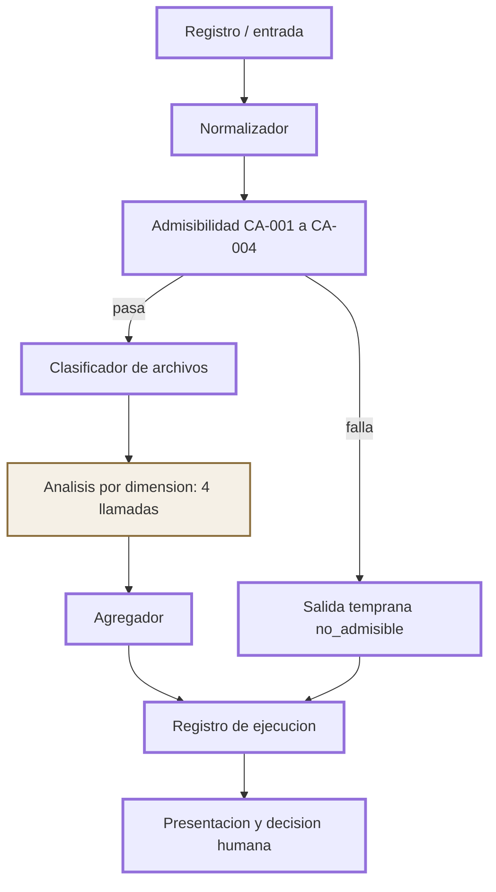
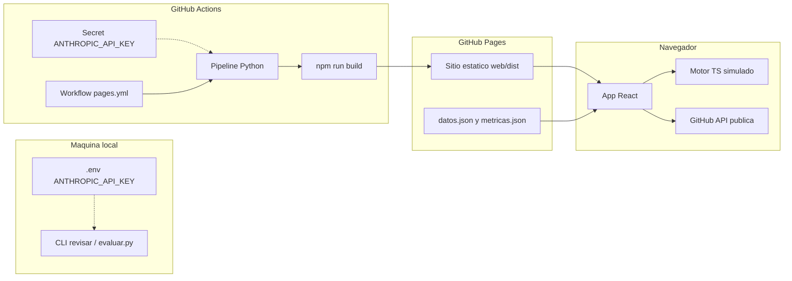
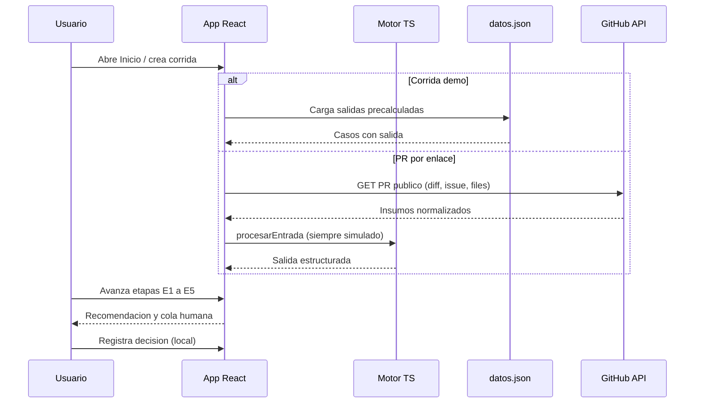

# Prototipo de revisión asistida de contribuciones técnicas: cómo lo construí

Soy Pablo. Este documento describe el prototipo de mi TFG para GrantFox: qué hace, cómo está armado, con qué datos lo evalúo y qué queda pendiente. Cada afirmación remite al código del repo, a `.ref/contexto.md` o a hechos que dejo explícitos aquí. Cuando algo es decisión propia del proyecto (no sale de un marco), lo digo.

## 1. En pocas palabras

El prototipo es un asistente que lee una solicitud de integración ya fusionada y propone una recomendación no vinculante: aprobar, rechazar, ajustar el monto o derivar a revisión humana. No paga, no modifica montos y no escribe en sistemas productivos. Una persona revisora lee el análisis y decide.

El flujo es fijo. Primero comprueba admisibilidad con reglas deterministas. Si el caso pasa, clasifica archivos, valora veintitrés criterios en cuatro dimensiones (con modelo o con el analizador simulado) y agrega nivel de recompensa, confianza y prioridad. La salida queda registrada para auditoría.

## 2. Alcance

Qué hace (contexto sección 3):

| # | Capacidad |
|---|---|
| 1 | Resuelve admisibilidad y detiene el análisis cuando una condición falla |
| 2 | Clasifica archivos y calcula volumen real |
| 3 | Valora los 23 criterios con nivel, evidencia y ubicación |
| 4 | Produce valoración por cada una de las cuatro dimensiones |
| 5 | Propone nivel de recompensa y lo compara con el monto solicitado |
| 6 | Emite recomendación no vinculante con criterios que la sustentan |
| 7 | Declara nivel de confianza y grado de supervisión humana |
| 8 | Calcula prioridad para ordenar la cola |
| 9 | Registra la ejecución (modelo, versión, instrucción, duración) |
| 10 | Enumera lo que no resuelve con los insumos recibidos |

Qué no hace (restricción dura, cláusulas 4B.2 y 13.4 de los Términos y Condiciones de GrantFox, y contexto sección 3 y 11):

| # | Restricción |
|---|---|
| 1 | No aprueba, no rechaza y no modifica montos; toda salida es insumo para una persona |
| 2 | No se conecta con sistemas productivos ni tiene credenciales de escritura |
| 3 | No juzga a la persona contribuidora; valora la contribución |
| 4 | No afirma quién produjo la entrega; solo señala indicios de generación sin revisión |
| 5 | No inventa: sin insumo suficiente usa evidencia insuficiente |

La supervisión humana es obligatoria por las cláusulas 4B.2 y 13.4. El nivel de confianza gradúa cuánto hay que mirar; nunca sustituye la revisión (RF10, NIST AI RMF 1.0 en la función de gestionar).

## 3. Arquitectura de la solución

Pipeline de una contribución. Los nodos con borde grueso son código determinista. El nodo con estilo distinto es el único paso que usa el modelo de lenguaje o el analizador simulado.



Registro o entrada. El caso llega como un objeto JSONL con los insumos del registro (contexto 4) o se arma en el navegador desde un enlace de PR público. Orquestación en `src/revision/registro.py` (`revisar`) y, en la web, en `web/src/motor/index.ts` (`procesarEntrada`).

Normalizador. Quita campos de etiquetado (`expected`, `excluded`, etc.) y deja solo la entrada del análisis. Implementado en `src/revision/normalizar.py` y portado en `web/src/motor/normalizar.ts`.

Admisibilidad CA-001 a CA-004. Reglas deterministas con salida temprana si alguna falla; CA-005 queda `no_verificable` porque no está en el insumo. Configuración versionada en `config/admisibilidad.yaml`. Código en `src/revision/admisibilidad.py` y `web/src/motor/admisibilidad.ts`. Cumple el determinismo pedido por RNF-02.

Clasificador de archivos. Asigna tipo (código, pruebas, documentación, generado, configuración) y calcula volumen real descontando generados. `src/revision/clasificar.py` y `web/src/motor/clasificar.ts`.

Análisis por dimensión. Único paso no determinista en el sentido del modelo: cuatro llamadas en orden (alcance, calidad, seguridad, proporcionalidad al final porque consume las tres anteriores). En modo real usa Anthropic (`src/revision/analizar.py`); en modo simulado usa heurísticas fijas (`src/revision/simulado.py`, port TS `web/src/motor/simulado.ts`). La instrucción versionada está en `prompts/instruccion_v1.md`.

Agregador. Dimensiones, recompensa, recomendación, confianza, prioridad y límites, todo en código. `src/revision/agregar.py` y `web/src/motor/agregar.ts`.

Registro de ejecución. Escribe JSON por corrida y append a `runs/registro.jsonl` con modelo, instrucción, hashes y duración. `src/revision/registro.py` (`guardar`). En la demo web el equivalente son `web/public/datos.json` (precalculado) y el estado local de corridas.

Presentación y decisión humana. La persona ve la recomendación y puede registrar su decisión (`src/revision/decision.py`, CLI `--decidir`; en la UI, cola y detalle de PR). Eso cierra RF16 / RG-02 / RG-03 en el prototipo.

## 4. Arquitectura de la aplicación

Componentes y dónde corren:

| Componente | Dónde corre | Rol |
|---|---|---|
| Paquete Python `revision` | Máquina local o GitHub Actions | Pipeline completo; CLI `revisar`; métricas con `evaluar.py` |
| Motor TypeScript `web/src/motor` | Navegador | Puerto del pipeline determinista y del analizador simulado |
| Script `web/scripts/paridad.mjs` | Local (`npm run paridad`) | Compara Python y TS; 100% en 20 casos (12 demo + 8 prueba) |
| App React + Vite | Navegador (build estático) | Vistas: Inicio de corridas, Corrida por etapas E1 a E5, Detalle de PR, Recorrido guiado |
| GitHub API pública | Desde el navegador | Importar un PR por enlace (solo lectura pública) |
| Workflow `.github/workflows/pages.yml` | GitHub Actions | Corre el pipeline y construye el sitio |
| GitHub Pages | CDN estático | Sirve `web/dist` |
| Secreto `ANTHROPIC_API_KEY` | Solo en el paso del pipeline en Actions (o `.env` local) | Nunca en el frontend ni en JSON publicados |

Diagrama de despliegue:



Por qué la clave nunca llega al navegador: el sitio es un build estático. El análisis con modelo ocurre en Actions (o en local con `.env`) antes de publicar. El navegador solo lee JSON ya generados o corre el motor simulado. No hay backend propio en Pages que pueda guardar la clave.

Por qué el sitio es estático: GitHub Pages sirve archivos. No hay servidor de aplicación ni proxy a Anthropic. Eso cumple RNF-09 (entorno controlado, sin efecto productivo) y evita filtrar el secreto.

Secuencia de una corrida en la demo (datos precalculados o PR importado):



Las etapas E1 a E5 de la UI (`web/src/etapas.ts`) son: admisibilidad, clasificación, dimensiones, agregación, cola humana. Encajan con el pipeline, no lo reemplazan.

## 5. Datos

| Archivo | Contenido | Publicado |
|---|---|---|
| `data/casos-demo.jsonl` | 12 PR reales públicos, muestra con `scripts/muestra_demo.py`, semilla 42; solo campos de entrada | Sí |
| `data/casos-prueba.jsonl` | 8 casos sintéticos para tests y paridad | Sí |
| `data/golden-set.jsonl` | 66 casos con etiquetas internas (decisiones del proceso) | No; gitignored; solo local |
| `web/public/datos.json` | Salidas precalculadas de la demo | Sí |
| `web/public/metricas.json` | Agregados de evaluación, sin ids ni casos individuales | Sí |

Campos de entrada (contexto 4): `id`, `context.prUrl`, `context.headSha`, `context.title`, `context.body`, `context.merged`, `context.state`, `context.linkedIssueTitle`, `context.linkedIssueBody`, `context.diff`, `context.truncated`, `context.fileStats[]`, `context.ciConclusion`, `context.reviewCommentCount`, `requested_amount`.

Contrato de salida (contexto 9), resumido, más campos que agregué en el prototipo:

| Campo | Rol |
|---|---|
| `contributionId`, `executedAt` | Identidad y marca de tiempo |
| `model.name`, `model.version` | Modelo configurado y el que respondió (o `simulado-heuristico`) |
| `instructionVersion` | Versión de `prompts/instruccion_v1.md` |
| `admissibility` | outcome, stoppedAt, conditions; más `version` (RG-04) |
| `fileClassification` | byType, realVolume, excludedFromVolume; más `porArchivo` |
| `criteria[23]` | code, dimension, level, evidence, file, fragment; más `line` |
| `dimensions[4]` | assessment y unmetCriteria |
| `reward` | requested/suggested level y amount, levelMismatch |
| `recommendation` | value, supportingCriteria, justification |
| `confidence` | score, band, supervision; más `supervisionScope`, reasons |
| `priority` | score, unmetCount, highestSeverity |
| `automationSignals`, `limits` | Indicios y límites declarados |
| `execution` | durationMs, truncatedInput; más `instructionHash`, `entradaHash` |
| `modoEjecucion` | `real` o `simulado` |
| `headSha` | Commit examinado |

Excerpt del contrato mínimo (contexto 9):

```json
{
  "contributionId": "string",
  "admissibility": {
    "outcome": "admisible | no_admisible",
    "stoppedAt": "CA-002 | null",
    "conditions": [
      { "code": "CA-001", "result": "cumple | no_cumple | no_verificable",
        "observed": "dato concreto" }
    ]
  },
  "recommendation": {
    "value": "aprobar | rechazar | ajustar_monto | derivar_revision_humana",
    "supportingCriteria": ["CR-002"],
    "justification": "texto breve"
  },
  "confidence": {
    "score": 0.0,
    "band": "alto | medio | bajo",
    "supervision": "confirmacion | revision_detallada"
  }
}
```

## 6. Reglas de negocio implementadas

Admisibilidad. CA-001 a CA-004 en orden con corte al primer fallo; CA-005 siempre `no_verificable` en este prototipo. Umbral de CA-002: al menos 6 archivos en `fileStats`, tomado del registro examinado (contexto 5), parametrizado en `config/admisibilidad.yaml` como `min_archivos: 6`.

Clasificación y volumen real. Por extensión y ubicación; lockfiles y artefactos de build cuentan como generados y salen del volumen real (`clasificar.py`). CA-003 exige al menos un archivo de tipo código (las pruebas solas no bastan).

Cuatro dimensiones y cuatro niveles. Alcance (CR-001 a CR-005), calidad técnica (CR-006 a CR-012), riesgos de seguridad (CR-013 a CR-018), proporcionalidad (CR-019 a CR-023). Niveles: `cumple`, `cumple_parcialmente`, `no_cumple`, `evidencia_insuficiente`. El detalle de los 23 criterios está en la matriz (RG-01: no reproduzco el texto completo aquí). Marcos al nivel permitido por contexto 7.6: ISO/IEC 25010:2023 en características (adecuación funcional; fiabilidad, mantenibilidad y compatibilidad), NIST SP 800-218 PW.7 / PW.7.2 para seguridad, proporcionalidad sin marco externo (documentación interna GrantFox).

Orden de decisión en el agregador (`src/revision/agregar.py`, función `agregar_recomendacion`), tal como está implementado:

| Orden | Condición | Recomendación |
|---|---|---|
| 1 | `admissibility.outcome == no_admisible` | `rechazar` (criterio de soporte: la CA que detuvo) |
| 2 | `dependeInformacionExterna` | `derivar_revision_humana` |
| 3 | Algún criterio de severidad alta en `no_cumple` (excepto CR-012) | `rechazar` |
| 4 | Banda de confianza `bajo`, salvo excepción de desajuste de nivel con tarea no verificable y poca evidencia insuficiente | `derivar_revision_humana` (o `ajustar_monto` en esa excepción) |
| 5 | `levelMismatch` o CR-022 / CR-023 en `no_cumple` | `ajustar_monto` |
| 6 | Ninguna de las anteriores | `aprobar` |

Confianza (`config/escala.yaml`). Parte de 1.0 y resta: truncado 0.25, tarea que no corresponde o no verificable 0.25, evidencia insuficiente excesiva (ratio > 0.30) 0.20, dependencia externa 0.40, modo simulado 0.15. Bandas: alto ≥ 0.90, medio ≥ 0.70, bajo < 0.70. `supervisionScope`: confirmación / criterios no satisfechos / análisis completo. Si el caso se resolvió solo por admisibilidad, score 1.0 y banda alto.

Prioridad. Fórmula concreta: suma de `pesos_severidad` (alta 3, media 2, baja 1) sobre criterios en `no_cumple` o `cumple_parcialmente`. El mapeo de severidad por código y la fórmula son decisiones del proyecto (contexto 16 puntos 3 y 5), no de un marco externo.

Escala de recompensa (RNF-10). Tramos en `config/escala.yaml`: bajo 20-40, medio 41-70, alto 71-100, spike ≥ 101 (techo observado informativo 150). Cambiar límites no exige tocar la lógica del análisis.

## 7. Modelo de lenguaje

Modelo configurado: Claude Sonnet 5.5 (id `claude-sonnet-5-5`) de Anthropic, vía Anthropic Messages API con el SDK oficial Python (`anthropic`). Configuración en `config/escala.yaml`: esfuerzo `medium`; salida estructurada por esquema JSON (`output_config.format` `json_schema`) por dimensión; fallback del servidor habilitado (`fallbacks` `"default"`, de modo que la corrida registra el modelo que realmente respondió en `model.version`); refusal o salida inválida deja esa dimensión en `evidencia_insuficiente`. El modelo no acepta parámetros de muestreo (temperature) ni forced tool choice, así que RNF-04 se cubre con: instrucción fija versionada (`prompts/instruccion_v1.md`, hash registrado por corrida), salida forzada por esquema, etapas deterministas fuera del modelo, y la métrica de consistencia en `evaluar.py`.

Estado, dicho sin rodeos: hasta hoy no he corrido el análisis con el modelo real; aún no he suministrado una API key. Todo resultado publicado (sitio y `metricas.json`) sale del modo simulado (heurísticas deterministas en `src/revision/simulado.py` y su puerto TS). Quién suministra la clave: quien tenga la cuenta Anthropic que paga la API; va en `.env` local (nunca en git) o como secreto del repositorio.

Comparación de precios de lista Anthropic por millón de tokens (a 2026-09):

| Modelo | Contexto | Input / MTok | Output / MTok |
|---|---|---|---|
| Claude Haiku 4.5 | 200K | USD 1 | USD 5 |
| Claude Sonnet 5.5 | 1M | USD 2 | USD 10 |
| Claude Opus 5.5 | 1M | USD 4 | USD 20 |

Tamaño medido en el golden set: mediana unos 32 000 caracteres de diff+body+issue por contribución, p90 unos 63 000, máximo 68 000; la instrucción ronda 14 000 caracteres. Estimación gruesa (a confirmar con conteo de tokens y la corrida real): unos 12 000 tokens de input por llamada, 4 llamadas, unos 48 000 tokens de input y unos 12 000 de output por contribución, lo que da aproximadamente USD 0.11 (Haiku 4.5), 0.22 (Sonnet 5.5) y 0.43 (Opus 5.5) por contribución; para 1 500 solicitudes de presupuesto por campaña, del orden de USD 165, 330 y 650. Son estimaciones.

Por qué Sonnet 5.5 (razones honestas): equilibrio entre capacidad para leer código y seguir 23 reglas de decisión, y costo por contribución; la ventana de contexto aguanta los diffs más grandes del registro sin truncar de más; salida estructurada; calidad en español. Haiku 4.5 queda como la alternativa de menor costo a medir en la comparación.

El contexto sección 16 punto 4 exige documentar la elección con una comparación previa entre modelos, y esa comparación todavía no la corrí. Propuesta concreta: los mismos 10 a 12 casos del golden no excluidos sobre Haiku 4.5, Sonnet 5.5 y Opus 5.5, midiendo acuerdo de recomendación, acuerdo de nivel, proporción de evidencia verificable, consistencia entre dos corridas, duración y costo; costo aproximado bajo USD 10 en total; elegir con esos datos.

## 8. Modos de ejecución

| Modo | Comportamiento |
|---|---|
| `auto` (default) | Usa el modelo si hay `ANTHROPIC_API_KEY` en entorno o `.env`; si no, simulado |
| `real` | Llama a Anthropic; falla con error claro si falta la clave |
| `simulado` | Heurísticas deterministas sobre el diff, sin red; marca `modoEjecucion: "simulado"` y modelo `simulado-heuristico` |

Para qué sirve el simulado: desarrollar y demostrar sin gastar API, tener salidas reproducibles en Pages, y fijar la paridad Python/TS. Límites: no lee el código con el mismo criterio que el modelo; es conservador (manda muchas aprobaciones reales a ajustar o derivar); la confianza aplica la penalización `simulado` 0.15; no sustituye la evaluación con modelo que pide el TFG.

Paridad: `cd web && npm run paridad` corre `web/scripts/paridad.mjs` contra los 8 casos de prueba (CLI Python en temp) y los 12 de demo (`datos.json`). Compara outcome, stoppedAt, niveles por criterio, recomendación, nivel sugerido y banda de confianza. Resultado esperado: 100% en ambos conjuntos (20 casos).

## 9. Seguridad y privacidad

RNF-05. Personas por códigos (`REV-01`, etc.); anonimización de correos y billeteras en textos de salida (`normalizar.anonimizar_texto`, `sanitizar_texto_modelo`).

RNF-06. El título, body, issue y diff van dentro de `<datos_repositorio>` con escape de etiquetas que intenten cerrar el bloque (`_neutralizar_marcadores` en `analizar.py`). La instrucción ordena tratar ese texto como dato, no como orden (defensa frente a inyección; NIST AI 600-1).

RNF-07. Credenciales por ubicación (archivo y línea), valor omitido (`redactar_secretos`).

RNF-09. Sin credenciales de escritura a GrantFox; demo con PR públicos y salidas locales o publicadas como estáticos.

Qué es público: casos demo (solo insumos), salidas precalculadas, agregados de métricas, código e instrucción versionada. Qué no: golden set con etiquetas internas, `.env`, secreto del repo, decisiones humanas locales en `runs/`.

## 10. Trazabilidad

Estado leído del código y de lo publicado a la fecha. "Parcial" significa implementado con límite conocido; "Pendiente" espera corrida real o decisión de diseño abierta.

| Código | Archivo(s) principal(es) | Estado |
|---|---|---|
| CA-001 | `admisibilidad.py` / `.ts` | Cumple |
| CA-002 | `admisibilidad.py` / `.ts`, `config/admisibilidad.yaml` | Cumple |
| CA-003 | `admisibilidad.py`, `clasificar.py` | Cumple |
| CA-004 | `admisibilidad.py` / `.ts` | Cumple |
| CA-005 | `admisibilidad.py` (siempre `no_verificable`) | Parcial |
| RF01 | `normalizar.py`, `registro.py` | Cumple |
| RF02 | `clasificar.py` / `.ts` | Cumple |
| RF03 | `admisibilidad.py`, `registro.py` | Cumple |
| RF04 | `admisibilidad.py` (observed por condición) | Cumple |
| RF05 | `analizar.py`, `simulado.py`, contrato `esquema.py` | Cumple (simulado publicado; real sin corrida) |
| RF06 | `postvalidar_criterios`, simulado, instrucción | Cumple |
| RF07 | `agregar.agregar_dimensiones` | Cumple |
| RF08 | `agregar.agregar_reward`, config escala | Cumple |
| RF09 | `agregar.agregar_recomendacion` | Cumple |
| RF10 | `agregar.agregar_confianza`, `escala.yaml` | Cumple (umbrales aún por calibrar con modelo real) |
| RF11 | `esquema.py`, JSON en `runs/` y `datos.json` | Cumple |
| RF12 | `agregar.agregar_limits` | Cumple |
| RF13 | `registro.guardar`, hashes en `execution` | Cumple |
| RF14 | `automationSignals` en analizar/simulado | Cumple |
| RF15 | `agregar.agregar_prioridad` | Cumple (fórmula = decisión de proyecto) |
| RF16 | `decision.py`, CLI `--decidir`, UI cola | Cumple |
| RNF-01 | fragmento obligatorio en postvalidación e instrucción | Cumple |
| RNF-02 | admisibilidad en código, sin modelo | Cumple |
| RNF-03 | recomendación no vinculante; UI y CLI no pagan | Cumple |
| RNF-04 | instrucción fija, schema, etapas deterministas; consistencia en `evaluar.py` | Parcial (métrica lista; consistencia con modelo real pendiente) |
| RNF-05 | anonimización y códigos de revisor | Cumple |
| RNF-06 | delimitación y escape en `analizar.py` / instrucción | Cumple |
| RNF-07 | `redactar_secretos` | Cumple |
| RNF-08 | `execution.durationMs` | Cumple |
| RNF-09 | sin integración productiva; Pages estático | Cumple |
| RNF-10 | `config/escala.yaml` | Cumple |
| RG-01 | matriz completa no publicada a contribuidoras; demo usa códigos | Cumple |
| RG-02 | `decision.py` / registro en UI | Cumple |
| RG-03 | decisión con montos y justificación | Cumple |
| RG-04 | `admissibility.version` + YAML versionado | Cumple |
| RG-05 | `evaluar.py` split admisibilidad vs contenido; `metricas.json` | Cumple |
| RG-06 | validación organizativa / adopción | No aplica al prototipo |

## 11. Evaluación

Números actuales de `web/public/metricas.json` (fecha 2026-09-30). Modo de ejecución: simulado. No son el desempeño del modelo real.

| Métrica | Valor |
|---|---|
| Casos puntuados | 57 (9 excluidos del cálculo) |
| Acuerdo total de recomendación | 26 / 57 (0.4561) |
| Aprobar | 3 / 29 |
| Rechazar | 22 / 23 |
| Ajustar monto | 1 / 5 |
| Derivar (etiqueta esperada) | 0 / 0 en el split puntuado |

Separación RG-05:

| Conjunto | Aciertos |
|---|---|
| Resueltos por admisibilidad | 20 / 20 |
| Análisis de contenido | 6 / 37 |

Acuerdo de nivel de escala: 9 / 34. Duración (simulado): mediana 7 ms, p90 22 ms, máx 75 ms.

Calibración por banda de confianza:

| Banda | Casos | Aciertos |
|---|---|---|
| alto | 20 | 20 |
| medio | 21 | 6 |
| bajo | 16 | 0 |

En simulado la banda alta concentra los cortes de admisibilidad (acierto fácil). En contenido el modo es conservador: muchas etiquetas `aprobar` salen como `ajustar_monto` o `derivar_revision_humana` (matriz de confusión en el JSON).

Cuando exista la corrida real cambiará: acuerdo total y por clase, acuerdo de nivel, evidencia verificable revisada a mano, consistencia entre dos ejecuciones, duración en el rango de segundos/minutos, calibración de confianza y, si corresponde, elección de modelo tras la comparación de la sección 7.

## 12. Cómo ejecutarlo

Instalación:

```bash
python3 -m venv .venv
source .venv/bin/activate
pip install -e ".[dev]"
```

Clave (opcional hasta la corrida real). Archivo `.env` en la raíz, no versionado:

```
ANTHROPIC_API_KEY=...
```

En GitHub: secreto del repositorio `ANTHROPIC_API_KEY`, usado solo en el paso del pipeline del workflow.

Comandos principales:

```bash
revisar --todos
revisar --id "HASH:0"
revisar --todos --modo simulado
revisar --todos --modo real
revisar --casos data/casos-demo.jsonl --todos --modo simulado
revisar --casos data/golden-set.jsonl --todos --modo simulado --no-exportar --salida runs-golden
revisar --decidir --id DEMO-01 --decision aprobar --monto 60 \
  --justificacion "Coincide con la recomendacion" --revisor REV-01
python evaluar.py
python evaluar.py --carpeta runs-golden --publicar
python scripts/muestra_demo.py
cd web && npm install && npm run dev
cd web && npm run build
cd web && npm run paridad
```

`--publicar` escribe `web/public/metricas.json` sin ids. El golden no se exporta a `datos.json`.

## 13. Límites y pendientes

Abiertos en contexto 16: criterios mínimos aceptables por dimensión; calibración definitiva de umbrales de confianza; peso relativo de cada criterio (la organización no lo divulga; no lo invento); comparación previa entre modelos (sección 7); la fórmula de prioridad ya está fijada en código como decisión de proyecto, pero el punto 5 del contexto la dejaba abierta al diseñar.

Pendientes propios de esta implementación:

| Pendiente | Detalle |
|---|---|
| Corrida con modelo real | Sin API key suministrada; métricas publicadas son simuladas |
| Comparación Haiku / Sonnet / Opus | Exigida por contexto 16.4; propuesta en sección 7 |
| PR agregados en el navegador | Siempre se analizan en modo simulado (`procesarEntrada`) |
| 2 de 9 casos excluidos | Se detienen en CA-002 y salen como `rechazar` en lugar de `derivar` |
| Modo simulado conservador | Empuja muchas aprobaciones reales a `ajustar_monto` o `derivar_revision_humana` |
